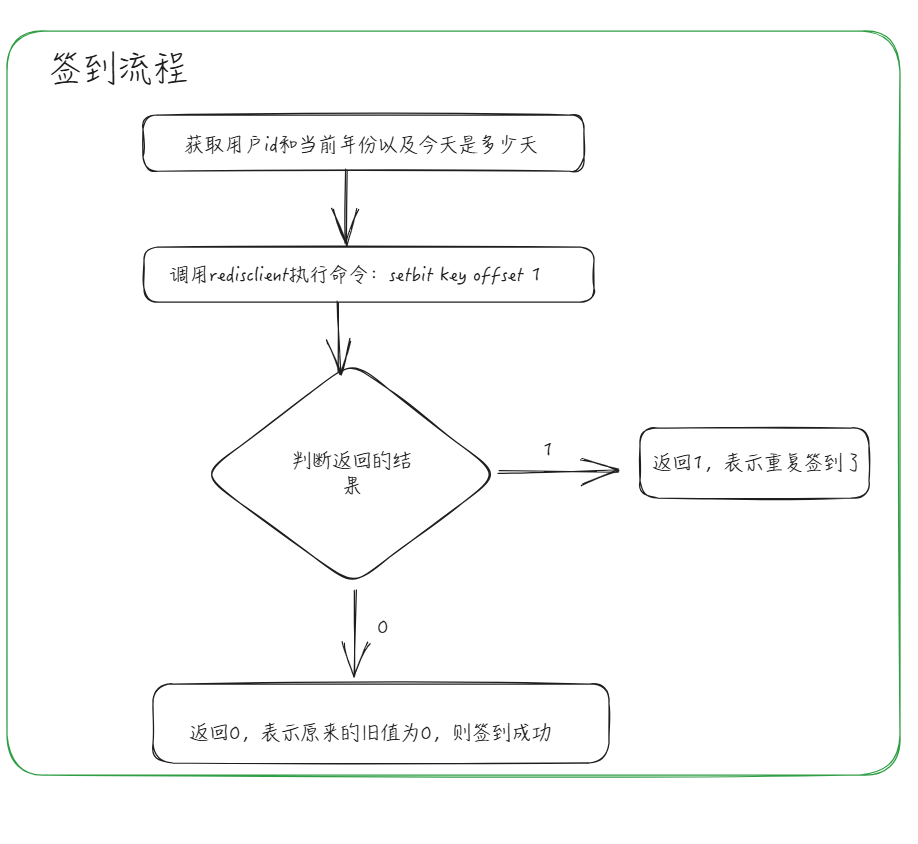

# 用户签到场景

##  key的设计

签到记录以年为单位，一个用户，对应一张位图（`Bitmap`），表示用户在一年内的签到情况。

- `key` 的设计：`user:sign:%d:%d`，第一个占位符表示年份，第二个占位符表示用户的编号。
- `bitmap` 值的设计：由于一年只有 **365** 或 **366** 天，因此我们只需要 `bitmap` 里面的前 **366** 位，即 **0-365** 位。

## 签到流程

~~~go
// Register 签到
func (s *UserSvc) Register(ctx *gin.Context) {
	user := &domain.User{}
	err := ctx.ShouldBindJSON(user)

	if err != nil {
		ctx.JSON(http.StatusBadRequest, gin.H{
			"code": 1,
			"msg":  "error",
		})
		return
	}
	now := time.Now()
	// 获取当前的年份
	year := now.Year()
	// 获取当前日期是今年的第几天
	dayOfYear := now.YearDay()
	// 签到 key: user:sign:年份:用户ID
	key := fmt.Sprintf("user:sign:%d:%d", year, user.ID)
	// setbit key offset value
	oldValue, err := conf.RedisClient.SetBit(ctx, key, int64(dayOfYear), 1).Result()
	if err != nil {
		ctx.JSON(http.StatusInternalServerError, gin.H{
			"code": 1,
			"msg":  "error",
		})
		return
	}
	if oldValue == 1 {
		ctx.JSON(http.StatusOK, gin.H{
			"code": 0,
			"msg":  "重复签到",
		})
		return
	}
	ctx.JSON(http.StatusOK, gin.H{
		"code": 0,
		"msg":  "签到成功",
	})
	return
}
~~~

## 获取指定年份的累计签到天数

~~~go
// GetCumulativeDays 获取指定年份的累计签到天数
func (s *UserSvc) GetCumulativeDays(ctx *gin.Context) {
	// 获取用户信息
	userId := ctx.Query("user_id")
	// 获得时间
	now := time.Now()
	// 当前年份
	year := now.Year()
	// 当前天数的偏移量
	dayOfYear := now.YearDay()
	// 拼接key
	key := fmt.Sprintf("user:sign:%d:%s", year, userId)
	segmentSize := 63
	cumulativeDays := 0
	// bit操作
	bitOps := make([]any, 0)
	for i := 0; i < dayOfYear; i += segmentSize {
		size := segmentSize
		if i+segmentSize > dayOfYear {
			size = dayOfYear - i + 1
		}
		// GET, usize,#i
		// get,u25,190
		bitOps = append(bitOps, "GET", fmt.Sprintf("u%d", size), fmt.Sprintf("%d", i))
	}

	values, err := conf.RedisClient.BitField(ctx, key, bitOps...).Result()
	if err != nil {
		ctx.JSON(http.StatusInternalServerError, gin.H{
			"code": 1,
			"msg":  "error",
		})
		return
	}
	// 遍历
	for idx, value := range values {
		if value != 0 {
			size := segmentSize
			if (idx+1)*segmentSize > dayOfYear {
				size = dayOfYear % segmentSize
			}
			for j := 0; j < size; j++ {
				// 位运算判断结果
				if (value & (1 << (size - 1 - j))) != 0 {
					cumulativeDays++
				}
			}
		}
	}
	// 返回结果
	ctx.JSON(http.StatusOK, gin.H{
		"code": 0,
		"msg":  "success",
		"data": cumulativeDays,
	})
	return
}
~~~

要实现统计一年里的签到次数，我们需要用到 `Redis` 的 `BITFIELD` 命令。

`Redis` 的 `BITFIELD` 命令是一个非常强大的命令，它允许你执行多种位级操作，包括读取、设置、增加位字段。这个命令能够操作存储在字符串中的位数组，并可以看作是直接在字符串上执行复杂的位操作。用法如下所示：

~~~bash
BITFIELD key [GET type offset] [SET type offset value] [INCRBY type offset increment]
~~~

- 获取时间因子：
  - **当前年份：** 通过 `year := now.Year()` 获取。
  - **今天是今年的第几天：** 通过`dayOfYear := now.YearDay()` 获取。
- **设定用户 ID：** 示例中假设用户 `ID` 为 **1**。
- **构建** **Redis** **Key**：使用年份和用户 `ID` 构建一个唯一的 `Redis Key`，格式为 `user:年份:用户ID`。
- **定义位操作的区间大小：**  由于位域命令 `BitField` 的每个操作可以处理的最大长度是 **63** 位，定义 `segmentSize := 63` 来批量处理签到数据。一个区间表示 **63** 天的签到情况。
- **封装** **BitField** **命令的参数：** 通过循环将从年初到当前日期的天数（`dayOfYear`）分割为每段最多包含 **63** 天的多个区间，动态构建 `BitField` 命令的参数。
- **执行 BitField 命令：** 使用 `rdb.BitField()` 方法执行构建好的 `BitField` 命令，返回一个包含位二进制对应的十进制表示的 `int64` 类型切片。
- **统计累计签到天数：** 遍历结果数组，针对每个非零的结果使用位运算（`&` 操作和位移操作）来检测签到情况，每发现一个 **1** 就将 `cumulativeDays` 增加 **1**。

> BITFIELD 是 Redis 中的一个命令，用于处理字符串键中的位字段。从 Redis 3.2 版本开始引入，它允许用户以一种非常高效的方式读取、写入和修改字符串键中的二进制位。与 GETBIT 和 SETBIT 命令不同，BITFIELD 可以操作多个位，并且可以处理长度不一的整数，而不仅仅是单个比特位。
> BITFIELD 命令支持以下几种操作：
> GET - 获取一个整数值。你可以指定类型（有符号或无符号）和偏移量，来读取一个特定长度的整数。
> SET - 设置一个整数值。同样，你需要指定类型、偏移量和要设置的值。
> INCRBY - 对一个整数值进行增量操作。这可以用于计数器场景，你指定类型、偏移量和增量值。
> BITFIELD 命令可以接受多个子命令，这意味着你可以在一次调用中执行多个操作，减少网络往返次数，提高效率。
> 例如，以下是一个使用 BITFIELD 的命令示例：
>
> BITFIELD mykey
> GET u8 0
> GET u16 8
> SET u16 0 255s
> INCRBY u32 16 100
>
> 在这个例子中：
> 第一个 GET 子命令读取从偏移量0开始的8位无符号整数。
> 第二个 GET 子命令读取从偏移量8开始的16位无符号整数。
> SET 子命令将从偏移量0开始的16位设置为255。
> INCRBY 子命令将从偏移量16开始的32位整数增加100。
> BITFIELD 命令还支持溢出处理，通过 OVERFLOW 参数可以指定溢出行为，包括 WRAP（循环溢出）、SAT（饱和溢出）和 FAIL（失败并返回错误）。
> 注意，BITFIELD 命令处理的整数范围是有限的，最大为64位，如果你需要处理更长的整数，可能需要使用多个 BITFIELD 子命令或者其他的解决方案。

## 获取指定月份的签到情况

要实现统计某月的签到情况，同样我们也需要用到 `Redis` 的 `BITFIELD` 命令。

~~~go
// GetSignOfMonth 获取指定月份的签到情况
func (s *UserSvc) GetSignOfMonth(ctx *gin.Context) {
	userId := ctx.Query("user_id")
	now := time.Now()
	year := now.Year()
	// 获取当前月的天数
	days := time.Date(now.Year(), now.Month()+1, 1, 0, 0, 0, 0, now.Location()).Add(-24 * time.Hour).Day() // 31
	// 获取本月初是今年的第几天
	offset := time.Date(now.Year(), now.Month(), 1, 0, 0, 0, 0, now.Location()).YearDay()
	key := fmt.Sprintf("user:sign:%d:%s", year, userId)
	typ := fmt.Sprintf("u%d", days)
	values, err := conf.RedisClient.BitField(ctx, key, "Get", typ, offset).Result()
	if err != nil {
		ctx.JSON(http.StatusInternalServerError, gin.H{
			"code": 1,
			"msg":  "error",
		})
		return
	}
	signInSlice := make([]bool, days)
	if len(values) == 0 {
		signInBits := values[0]
		for i := 0; i < days; i++ {
			signInSlice[i] = (signInBits & (1 << (days - 1 - i))) != 0
		}
	}
	ctx.JSON(http.StatusOK, gin.H{
		"code": 0,
		"msg":  "success",
		"data": signInSlice,
	})
}
~~~

上述代码实现了统计当月的签到情况的功能，流程如下：

- 获取时间因子：

  - **当前年份**：通过 `year := now.Year()` 获取。
  - **当前月的天数**：通过 `time.Date(now.Year(), now.Month()+1, 1, 0, 0, 0, 0, now.Location()).Add(-24 * time.Hour).Day()` 计算。
  - **本月初是今年的第几天**：通过 `time.Date(now.Year(), now.Month(), 1, 0, 0, 0, 0, now.Location()).YearDay()` 获取。

- **设定用户** **`ID`**：示例中假设用户 ID 为 **1**。

- 构建

  `Redis key`和`BitField`命令的参数：

  - 使用年份和用户 `ID` 构建一个唯一的 `Redis Key`，格式为 `user:年份:用户ID`。
  - 使用当月天数 `days` 构建 `type` 参数 `fmt.Sprintf("u%d", days)`，表示操作的位字段宽度。

- **执行** **`BitField`** **命令**：通过 `rdb.BitField()` 方法执行 `BitField` 命令，返回一个包含位二进制对应的十进制表示的 `int64` 类型切片。

- **统计当月的签到情况**：通过位运算（与操作和位移操作）检测每天的签到状态，将结果以布尔切片形式返回，其中 `true` 表示签到，`false` 表示未签到。

我们可以根据布尔切片的元素在用户端展示当月的签到情况，例如 **签到日历**。

## bitmap

> 位图不是实际的数据类型，而是在 String 类型上定义的一组面向位的操作，将其视为位向量。由于字符串是二进制安全 blob，其最大长度为 512 MB，因此它们适合设置最多 2^32 个不同位。

基本命令：

- setbit key  offset value : 提供的偏移量处的一位设置为 0 或 1。
- getbit key  offset :  返回给定偏移处的位值。

